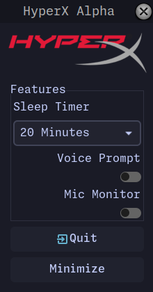

# HyerpxAlpha

Linux software for the Hyperx Alpha Wireless.



## Description

A simple application to provite the missing features on linux

- Battery Monitoring
- Sleep Timer
- Mic Monitor
- Voice Control

## Dependencies

- wxWidgets
- hidapi

## Installation

To install HyerpxAlpha, follow these steps:

1. Clone the repository:
   ```
   git clone https://github.com/IllicitFrog/HyerpxAlpha.git
   ```
2. Navigate to the project directory:
   ```
   cd HyerpxAlpha
   ```
3. Build the project using CMake:

   ```
   cmake -S . -B build
   cmake --build build
   ```

## Usage

After installation, you can run the HyerpxAlpha software with the following command:

```
bin/Hyerpx
```

## Contributing

Contributions are welcome! Please fork this repository and submit pull requests.

## License

This project is licensed under the MIT License. See the [LICENSE](LICENSE) file for details.
